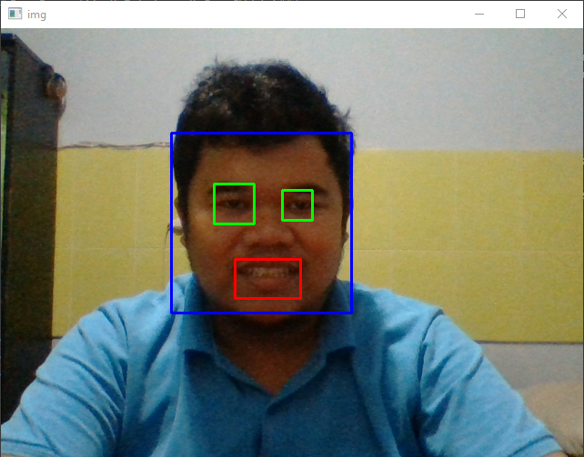

# Face, Eye, and Mouth Detection with OpenCV

This project demonstrates real-time detection of faces, eyes, and mouths using the OpenCV library in Python. The program captures video from a webcam, processes each frame to detect faces, and then identifies the eyes and mouth within the detected face.

## Features

- **Real-time face detection:** Detects faces in the video stream using the Haar cascade classifier.
- **Eye detection:** Identifies eyes within the detected face.
- **Mouth detection:** Identifies the mouth within the detected face, with adjustments to avoid false positives.
- **Keyboard control:** Press 'e' to exit the program.

## Prerequisites

- Python 3.x
- OpenCV (`cv2`) library
- Haar cascade XML files:
  - `haarcascade_frontalface_default.xml`
  - `haarcascade_eye.xml`
  - `haarcascade_mcs_mouth.xml`

## Installation

1. Clone this repository or download the files.

2. Install the required Python packages:
    ```bash
    pip install opencv-python
    ```

3. Ensure the Haar cascade XML files are located in the correct directory:
    ```text
    D:/A/OpenCV-Haarcascade/dataset/
    ```

## Usage

1. Run the Python script:
    ```bash
    python face_eye_mouth_detection.py
    ```

2. The webcam feed will open, and the program will start detecting faces, eyes, and mouths in real-time.

3. Press 'e' to exit the program.

## Code Explanation

The program uses the OpenCV library to process video frames in real-time. It first converts the frame to grayscale for more efficient detection. The Haar cascades are used to detect faces, eyes, and mouths. Detected features are highlighted with colored rectangles: blue for faces, green for eyes, and red for mouths.

## Example Output



## Conclusion:

This code detects faces, eyes, and mouths from video feeds in real-time. The face is marked with a blue box, the eyes with a green box, and the mouth with a red box. The program runs continuously until the user presses the e key to exit.

#### @Copyright 2024 | Real-Time_Face,_Eye,_and_Mouth_Detection_Based_OpenCV_Algoritm_Haarcascade

"# OpenCV-Haarcascade-Detection-Face-Eye-Mounth" 